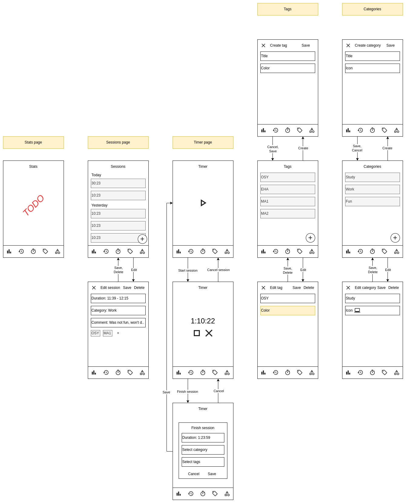

# fokus

Forest 2.0

## Mockup


## Info for developers

### Creating a form
To achieve consistency in code, all forms throughout the application are components. Those components, except maybe for a few exceptions, that do not reflect an object, use `FormBase` as their parent class to achieve consistency in their interface.

To create a form for an object, the developer should follow these simple steps:
1. create a class `ObjectXXXForm` that extends the `FormBase<T>` class _with the correct type!_
2. create `TextEditingController`s for all required form fields
3. select "create 3 overrides", and implement those functions
4. select "add parent's parameters to constructor"
5. manually add the optional (but likely required in the upper level component) fields into the form's constructor:

```
super.initialValue,
super.formViewType,
super.onDelete,
```

For reference, see other existing forms (i.e. `TagForm`, which is the simplest, but captures the idea well)
